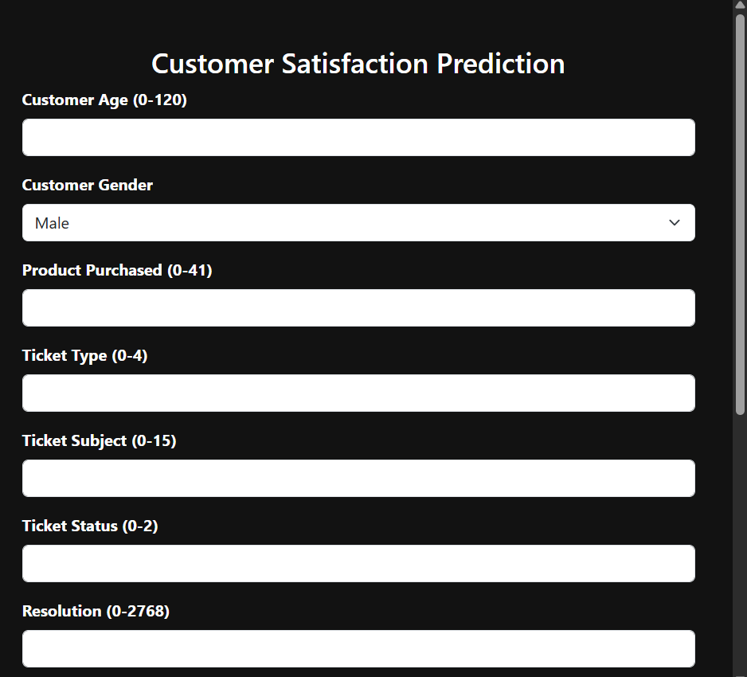
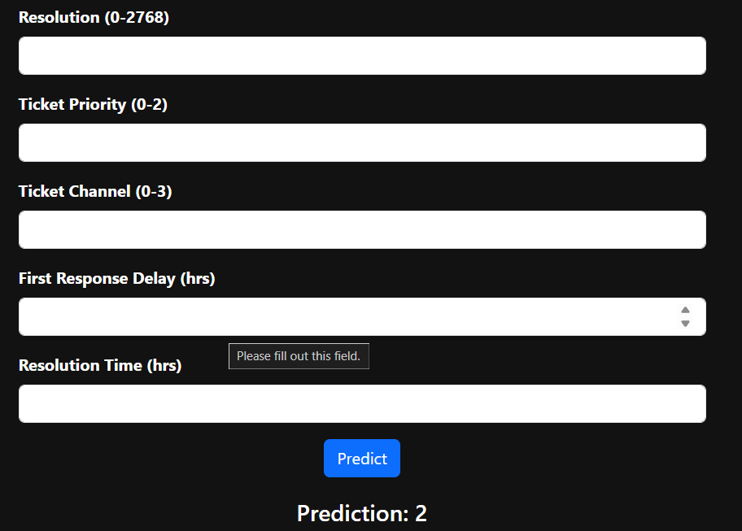

# Customer_Satisfaction_Prediction 

[](LICENSE)
🔗 **Repository:** [https://github.com/anasrobo/Customer\_Satisfaction\_Prediction](https://github.com/anasrobo/Customer_Satisfaction_Prediction)

---

## 📋 Table of Contents

* [💡 Project Overview](#-project-overview)
* [🗂️ Repository Structure](#️-repository-structure)
* [⚙️ Installation](#️-installation)
* [🧹 Data Cleaning & Preprocessing](#-data-cleaning--preprocessing)

  * [Initial Exploration](#initial-exploration)
  * [Handling Missing Values](#handling-missing-values)
  * [Feature Engineering](#feature-engineering)
  * [Encoding & Final Cleanup](#encoding--final-cleanup)
* [🔬 Class Balancing with SMOTE](#-class-balancing-with-smote)
* [🖥️ Running the Flask App](#️-running-the-flask-app)
* [📸 UI Screenshot](#-ui-screenshot)
* [🤝 Contributing](#-contributing)
* [📄 License](#-license)

---

## 💡 Project Overview

This project implements a **Customer Satisfaction Prediction** system using a machine learning ensemble model and a **Flask** web interface. Users can input customer and ticket-related features to predict satisfaction levels.

Key features:

* Interactive Flask UI for real-time predictions
* Comprehensive data cleaning and preprocessing pipeline
* Class balancing using SMOTE to handle imbalanced ratings

---

## 🗂️ Repository Structure

```
Customer_Satisfaction_Prediction/
├── backend/
│   └── models/
│       └── ensemble_model.pkl      # Trained ensemble model
├── frontend/
│   └── templates/
│       └── index.html             # Flask UI template
├── app.py                         # Flask app entry point
├── cleaned_dataset.csv            # Cleaned data for training
├── data_cleaning.ipynb            # Notebook demonstrating cleaning steps
├── README.md                      # Project documentation (this file)
└── requirements.txt               # Python dependencies
```

---

## ⚙️ Installation

1. **Clone the repository**:

   ```bash
   git clone https://github.com/anasrobo/Customer_Satisfaction_Prediction.git
   cd Customer_Satisfaction_Prediction
   ```

2. **Create a virtual environment**:

   ```bash
   python -m venv venv
   source venv/bin/activate  # On Windows: venv\Scripts\activate
   ```

3. **Install dependencies**:

   ```bash
   pip install -r requirements.txt
   ```

4. **Ensure the trained model is in place**:

   * Verify `backend/models/ensemble_model.pkl` exists. If not, train the model following the cleaning and SMOTE steps below.

---

## 🧹 Data Cleaning & Preprocessing

All steps are demonstrated in `data_cleaning.ipynb` and the Python scripts.

### Initial Exploration

* Loaded raw dataset using Pandas
* Inspected shape, column types, and missing values
* Visualized missingness with heatmaps

### Handling Missing Values

* Parsed date/time fields (`Date of Purchase`, `First Response Time`, `Time to Resolution`) into datetime objects
* Created duration features:

  * **First Response Delay (hrs)** = `First Response Time` − `Date of Purchase`
  * **Resolution Time (hrs)** = `Time to Resolution` − `Date of Purchase`
* Imputed numeric columns with median values using `SimpleImputer`
* Filled categorical missing values with the most frequent value

### Feature Engineering

* Dropped irrelevant or highly sparse columns (`Ticket ID`, `Customer Name`, `Customer Email`, `Ticket Description`)
* Converted datetime durations to numeric

### Encoding & Final Cleanup

* Label-encoded or one-hot-encoded categorical features (e.g., gender, product, ticket type)
* Ensured the target column (`Customer Satisfaction Rating`) is numeric and free of NaNs

---

## 🔬 Class Balancing with SMOTE

To address class imbalance in satisfaction ratings:

1. Split cleaned data into features **X** and target **y**
2. Applied **SMOTE** (Synthetic Minority Over-sampling Technique) on the training split:

   ```python
   from imblearn.over_sampling import SMOTE
   smote = SMOTE(random_state=42)
   X_train_res, y_train_res = smote.fit_resample(X_train, y_train)
   ```
3. Verified balanced class distribution before training the ensemble classifier

---

## 🖥️ Running the Flask App

1. **Launch the app**:

   ```bash
   python app.py
   ```
2. **Open your browser** at `http://127.0.0.1:5000/`
3. **Enter input values** for customer age, gender, ticket features, and timing
4. **Submit** to view predicted satisfaction

---

## 📸 UI Screenshot


*Figure: Screenshot of the Customer Satisfaction Prediction Interface*


---

## 🤝 Contributing

Contributions are welcome! Please:

1. Fork the repo
2. Create a feature branch (`git checkout -b feature-name`)
3. Commit your changes (`git commit -m 'Add feature'`)
4. Push to your branch (`git push origin feature-name`)
5. Open a Pull Request

---

## 📄 License

This project is licensed under the **MIT License**. See [LICENSE](LICENSE) for details.

---

> Built with ❤️ by Anas
